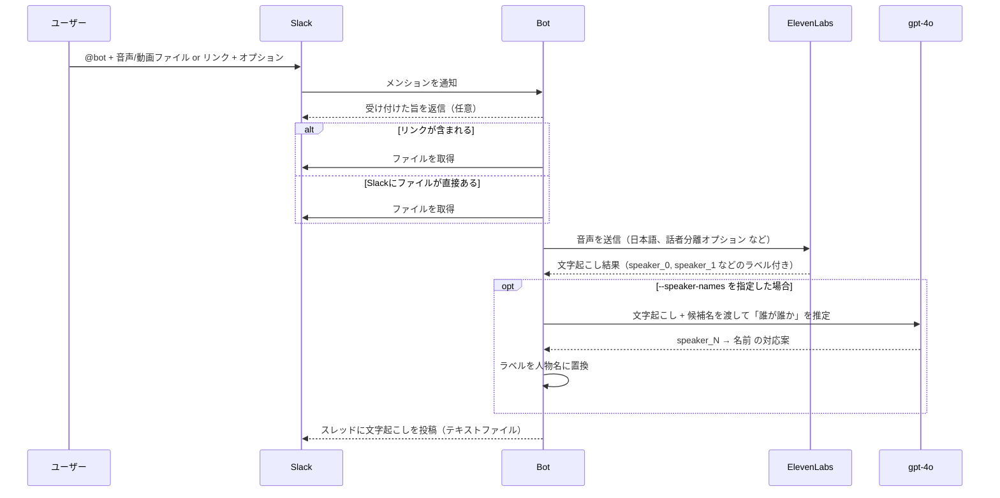

# ElevenLabs Transcribe Bot for Slack & Discord

A multi-platform bot that uses the [ElevenLabs Scribe API](https://elevenlabs.io/speech-to-text) to transcribe audio and video files. Supports both Slack and Discord platforms with unified transcription capabilities. Built with Deno and runs on Google Cloud Run.

## Features

- **Multi-platform support:** Works with both Slack and Discord
- Transcribes audio and video files when mentioned or via slash commands
- **Google Drive & YouTube integration:** Supports Google Drive file links and YouTube URLs for transcription
- **Speaker diarization:** Identifies different speakers in the conversation
- **Automatic timestamps:** Adds timestamps for better navigation
- **Audio event detection:** Detects music, laughter, and other audio events
- **Flexible output:** Returns transcripts as text files in the conversation thread

## Transcription Options

You can customize the transcription by adding options when mentioning the bot:

- `--no-diarize` - Disable speaker identification (default: enabled)
- `--no-timestamp` - Disable timestamps (default: enabled)
- `--no-audio-events` - Disable audio event detection (default: enabled)
- `--num-speakers N` - Specify the number of speakers (1-32, default: 2 when diarization is enabled)
- `--speaker-names "<name1>,<name2>"` - Specify speaker names (AI will automatically identify who is who)

Example:

```
@bot transcribe this file --no-timestamp --no-diarize
@bot transcribe this file --num-speakers 3
@bot https://drive.google.com/file/d/xxxxx/view --num-speakers 4
@bot transcribe this file --speaker-names "田中,山田"
```

**Note:**

- The `--num-speakers` option only works when speaker diarization is enabled (default). If you use `--no-diarize`, the num-speakers setting will be ignored.
- The `--speaker-names` option uses OpenAI to automatically identify which speaker is which based on the conversation content. You need to set `OPENAI_API_KEY` in your environment variables for this feature to work.

## Project Structure

```
src/
├── index.ts          # Main entry point and request router
├── slack-handler.ts  # Slack event handler
├── discord-handler.ts # Discord interaction handler
├── scribe.ts         # ElevenLabs Scribe API integration
├── slack.ts          # Slack API utilities
├── discord.ts        # Discord API utilities
├── types.ts          # TypeScript type definitions
└── utils.ts          # Helper functions for text processing
```

## Tech Stack

- [Deno](https://deno.land/) - JavaScript/TypeScript runtime
- [Google Cloud Run](https://cloud.google.com/run) - Container hosting platform
- [ElevenLabs Scribe API](https://elevenlabs.io/docs/api-reference/speech-to-text) - Speech-to-text transcription
- Slack Events API - Slack bot event handling
- Discord Interactions API - Discord bot interaction handling

## Setup

### Prerequisites

- [Deno](https://deno.land/manual/getting_started/installation) installed
- [Google Cloud SDK](https://cloud.google.com/sdk/docs/install) installed
- An ElevenLabs account and API key.
- A Google Cloud project with Cloud Run enabled.
- A Slack app with bot token and signing secret (for Slack bot).
- A Discord application with bot token and public key (for Discord bot).

### 1. Clone the repository

```bash
git clone <repository-url>
cd <repository-name>
```

### 2. Set up environment variables

Create a `.env` file in the project root directory and add the following environment variables.

```
ELEVENLABS_API_KEY="your-elevenlabs-api-key"
SLACK_BOT_TOKEN="your-slack-bot-token"
DISCORD_APPLICATION_ID="your-discord-app-id"
DISCORD_PUBLIC_KEY="your-discord-public-key"
DISCORD_BOT_TOKEN="your-discord-bot-token"
GOOGLE_SERVICE_ACCOUNT_KEY='{"type":"service_account","project_id":"..."}'  # Google service account JSON

# YouTube cookies (optional, required for some videos)
# For Cloud Run: Base64-encoded cookies file content
YOUTUBE_COOKIES_BASE64="base64-encoded-cookies-content"
# For local/container: Path to cookies file
# YOUTUBE_COOKIES="/path/to/cookies.txt"
```

### 3. Deploy to Cloud Run

Deploy the bot to Google Cloud Run:

```bash
make deploy
```

Or manually:

```bash
gcloud run deploy scribe-bot \
  --source . \
  --region asia-northeast1 \
  --allow-unauthenticated
```

### 4. Set up the Slack App

1. Create a new Slack app at https://api.slack.com/apps
2. Go to "OAuth & Permissions" and add the following bot token scopes:
   - `app_mentions:read` - To detect when the bot is mentioned
   - `files:read` - To read file information
   - `files:write` - To upload transcript files
   - `chat:write` - To send messages
3. Install the app to your workspace and copy the Bot User OAuth Token
4. Go to "Event Subscriptions" and enable events
5. Set the Request URL to your Cloud Run URL:
   ```
   https://YOUR-CLOUD-RUN-URL/slack/events
   ```
6. Subscribe to the following bot events:
   - `app_mention` - To detect when the bot is mentioned with files
7. Go to "Basic Information" and copy the Signing Secret

### 5. Set up the Discord Bot

1. Create a new Discord application at https://discord.com/developers/applications
2. Go to the "Bot" section and create a bot
3. Copy the Bot Token (you'll need this for `DISCORD_BOT_TOKEN`)
4. Go to the "General Information" section and copy:
   - Application ID (for `DISCORD_APPLICATION_ID`)
   - Public Key (for `DISCORD_PUBLIC_KEY`)
5. Go to the "Interactions Endpoint URL" section and set it to:
   ```
   https://YOUR-CLOUD-RUN-URL/discord/interactions
   ```
6. In the "Bot" section, enable the following Privileged Gateway Intents:
   - MESSAGE CONTENT INTENT (to read message content)
7. Generate an invite URL from the "OAuth2 > URL Generator" section with:
   - Scopes: `bot`, `applications.commands`
   - Bot Permissions: `Send Messages`, `Attach Files`, `Read Message History`
8. Use the generated URL to invite the bot to your Discord server
9. Register slash commands by running:
   ```bash
   npm run register-discord-commands
   ```

The Cloud Run URL can be found in the output of the `gcloud run deploy` command or in your Google Cloud Console.

## Usage

### Slack

#### With file uploads:

1. Upload an audio or video file to a Slack channel
2. Mention the bot in the same message or as a reply
3. (Optional) Add transcription options like `--no-timestamp` or `--no-diarize`
4. The bot will process the file and reply with a transcript text file

#### With Google Drive / YouTube links:

1. Share a Google Drive video/audio file link in a message
   - For YouTube, paste the video URL instead
2. Mention the bot in the same message with the link
3. (Optional) Add transcription options
4. The bot will download from Google Drive/YouTube and transcribe

Example: `@bot https://drive.google.com/file/d/xxxxx/view --num-speakers 3`
Example: `@bot https://www.youtube.com/watch?v=xxxxxxx --no-timestamp`

**Note:** Some YouTube videos may require authentication cookies to download. See the "YouTube Cookies Setup" section below.

### Discord

#### Using slash commands:

1. Use the `/transcribe` command in any channel
2. Attach an audio or video file to the command
3. (Optional) Add transcription options as command parameters
4. The bot will reply with the transcript as a text file

#### With file uploads:

1. Upload an audio or video file to a Discord channel
2. Reply to the message with `/transcribe` command
3. (Optional) Add transcription options
4. The bot will process and return the transcript

#### With Google Drive / YouTube links:

1. Use `/transcribe url:<drive_link>` command (YouTube URLs are also supported)
2. (Optional) Add transcription options as parameters
3. The bot will download and transcribe the file

Example: `/transcribe url:https://drive.google.com/file/d/xxxxx/view speakers:3`
Example: `/transcribe url:https://www.youtube.com/watch?v=xxxxxxx`

**Note:** Some YouTube videos may require authentication cookies to download. See the "YouTube Cookies Setup" section below.

## YouTube Cookies Setup

If you encounter "Sign in to confirm you're not a bot" errors when transcribing YouTube videos, you need to provide authentication cookies.

### Why This Error Occurs in Cloud Run but Not Locally

This error is more likely to occur in Cloud Run or other cloud environments than on your local Mac for several reasons:

1. **IP Address Reputation**:
   - **Cloud Run**: Uses shared data center IP addresses that are often flagged by YouTube's bot detection systems
   - **Your Mac**: Uses residential/office IP addresses that YouTube trusts more as legitimate user traffic

2. **Access Patterns**:
   - **Cloud Run**: Automated requests from server environments are more suspicious
   - **Your Mac**: Manual commands appear more like normal user behavior

3. **Network Context**:
   - Data center networks have a history of automated scraping, making them higher risk
   - Residential networks are associated with human users

**Solution**: Providing YouTube cookies helps authenticate the requests, making them appear as legitimate logged-in user access rather than anonymous bot traffic.

### Getting YouTube Cookies

#### Method 1: Browser Extension (Recommended)

This is the easiest and most reliable method:

**For Chrome/Edge:**

1. Install the extension "Get cookies.txt LOCALLY" from Chrome Web Store
2. Open YouTube (https://www.youtube.com) in your browser and **make sure you're logged in**
3. Click on the extension icon in your toolbar
4. Click "Export" → The extension will automatically format the cookies in Netscape format
5. Save the file as `cookies.txt` (the extension usually does this automatically)
6. The file will be downloaded to your Downloads folder

**For Firefox:**

1. Install the extension "cookies.txt" from Firefox Add-ons
2. Open YouTube (https://www.youtube.com) and **make sure you're logged in**
3. Click on the extension icon
4. Click "Export" → Save as `cookies.txt`

**Important**: Make sure you're **logged into YouTube** before exporting cookies, otherwise the cookies won't have authentication information.

#### Method 2: Using yt-dlp Directly

If you have `yt-dlp` installed locally, you can extract cookies from your browser:

```bash
# Extract cookies from Chrome (most common)
yt-dlp --cookies-from-browser chrome --print "%(title)s" "https://www.youtube.com/watch?v=VIDEO_ID"

# Extract cookies from Firefox
yt-dlp --cookies-from-browser firefox --print "%(title)s" "https://www.youtube.com/watch?v=VIDEO_ID"

# Extract cookies from Safari (macOS)
yt-dlp --cookies-from-browser safari --print "%(title)s" "https://www.youtube.com/watch?v=VIDEO_ID"
```

To save cookies to a file:

```bash
# This will use cookies from browser but you still need to export them manually
# The browser extension method is easier for getting the actual cookies.txt file
```

**Note**: Method 2 requires that your browser is still logged into YouTube. The browser extension method (Method 1) is generally easier and more reliable.

### For Cloud Run Deployment

1. Export your cookies to a `cookies.txt` file (see above)
2. Base64-encode the file content:
   ```bash
   base64 -i cookies.txt -o cookies_base64.txt
   # Or on macOS:
   base64 cookies.txt > cookies_base64.txt
   ```
3. Add the Base64-encoded content to your Cloud Run environment variables:

   ```bash
   gcloud run services update scribe-bot \
     --region asia-northeast1 \
     --set-env-vars YOUTUBE_COOKIES_BASE64="$(cat cookies_base64.txt)"
   ```

   Or add it to your `.env` file:

   ```
   YOUTUBE_COOKIES_BASE64="<paste base64 content here>"
   ```

### For Local/Container Usage

If running locally or in a container with file access:

1. Place the `cookies.txt` file in your project directory or container
2. Set the environment variable:
   ```
   YOUTUBE_COOKIES="/path/to/cookies.txt"
   ```

**Important Notes:**

- **Cookie Expiration**: YouTube cookies typically expire after several months (usually 6-8 months). When cookies expire, you'll see the same "Sign in to confirm you're not a bot" error again.
- **Cookie Refresh**: To refresh expired cookies:
  1. Re-export cookies from your browser (following the steps in "Getting YouTube Cookies" above)
  2. Base64-encode the new cookies file
  3. Update the `YOUTUBE_COOKIES_BASE64` environment variable in Cloud Run:
     ```bash
     gcloud run services update scribe-bot \
       --region asia-northeast1 \
       --update-env-vars YOUTUBE_COOKIES_BASE64="$(cat cookies_base64.txt)"
     ```
  4. Or update your `.env` file and redeploy
- **Monitoring**: If you start seeing authentication errors again after working fine, it's likely that the cookies have expired.
- **Security**: Keep your cookies file secure and never commit it to version control
- **Compliance**: Using cookies must comply with YouTube's Terms of Service

### Supported File Formats

- Audio: MP3, WAV, M4A, AAC, OGG, WebM
- Video: MP4, MOV, AVI, MPEG, WebM

### Output Format

The transcript will be formatted based on your options:

**With speaker diarization (default):**

```
[0:00] speaker_0: こんにちは、今日の会議を始めます。
[0:05] speaker_1: よろしくお願いします。
```

**Without speaker diarization:**

```
[0:00] こんにちは、今日の会議を始めます。
[0:05] よろしくお願いします。
```

**Without timestamps:**

```
speaker_0: こんにちは、今日の会議を始めます。
speaker_1: よろしくお願いします。
```

## Slackでの文字起こしフロー

非エンジニア向けの説明です。登場人物は「ユーザー」「Slack」「Bot」「ElevenLabs」「gpt-4o」です。

### 全体シーケンス (Mermaid)



## 話者識別（ダイアリゼーション）の仕組みと制約

- **段階1: ElevenLabsの話者分離**
  - ElevenLabs Scribeが音声を解析し、発話をタイムスタンプ付きのトークン列に分解します。
  - diarize有効時は、各発話に `speaker_0`, `speaker_1`, ... のようなラベルが付きます。
  - `--num-speakers` を指定すると、モデルへのヒントとして話者数を渡します（誤った数を渡すと精度が落ちる可能性があります）。

- **段階2: ラベル→人物名の推定（任意）**
  - `--speaker-names "田中,山田"` のように候補名を与えた場合のみ実行されます。
  - Botが文字起こし内容（語彙、一人称、呼称、文脈など）を **gpt-4o** に渡し、`speaker_N` と候補名の対応を推定します。
  - これは音の特徴から個人を特定するものではなく、テキストだけを根拠にした推測です。候補名リストにない名前は使いません。

### 重要な注意点（正確さの限界）

- **話者名の確定は厳密ではありません。** ElevenLabsの話者分離は強力ですが、`speaker_0`→実在の人物名の割当は
  gpt-4oによるテキスト推論のため、誤割当（入れ替わり・混在）が起こり得ます。
- **候補名の質と数に依存します。** 候補が多すぎる／似た役割の人が多いと誤りが増えます。できるだけ必要最小限の候補に絞ると良いです。
- **`--num-speakers` の誤指定は悪影響。** 実際より多い/少ない話者数を指定すると分離と整形の両方に影響します。
- **完全な音声話者認識ではありません。** 声質そのものから個人を同定する処理は行っていません。
